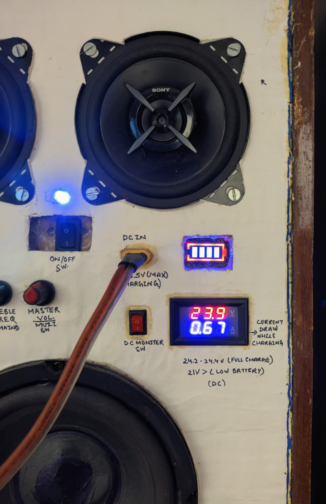

# 🔊 Custom-Built Audio Boom Box

> 📅 **Original Prototype: November 2024**  
> 🔄 **Current Version: Version 2**

A custom-built **portable 2.1-channel Bluetooth boom box** designed, assembled, and upgraded as a hands-on electronics and audio engineering project.

The project started as a functional **cardboard prototype (V1)** and was later rebuilt into **Version 2 using a repurposed Philips shelf-speaker enclosure**. The V2 enclosure provides a substantially more rigid and acoustically suitable structure, resulting in **better overall sound reproduction and improved bass response** compared with the original prototype.

The core audio electronics and battery system were retained from the original design. At the same time, V2 introduced practical hardware improvements including a dedicated **AUX input** and an upgraded **XT60 charging connector** for more robust high-current DC charging.

---

## 🎯 Project Overview

This project combines:

- 🔊 **2.1-channel audio amplification**
- 🎵 **Bluetooth wireless audio**
- 🎧 **AUX wired audio input**
- 🔋 **6S Li-ion rechargeable battery system**
- ⚡ **Protected battery charging**
- 📟 **Real-time voltage and current monitoring**
- 🛠️ **Custom wiring and hardware integration**
- 🪵 **Repurposed speaker enclosure**
- 🔧 **Hands-on prototyping and iterative hardware development**

The system consists of two stereo full-range drivers and a dedicated subwoofer, powered by a **TPA3116D2-based 2.1-channel amplifier**.

---

## 🔄 Version 1 → Version 2 Evolution

The project was developed iteratively, with Version 2 building upon the working electronics and battery system of the original prototype while addressing its enclosure and connectivity limitations.

| Feature | Version 1 — Original Prototype | Version 2 — Current Build |
|---|---|---|
| 🏠 **Enclosure** | Cardboard prototype enclosure | Repurposed Philips shelf-speaker enclosure |
| 🔊 **Acoustic Performance** | Limited by the flexible cardboard structure | Improved due to the more rigid speaker cabinet |
| 🎧 **AUX Input** | Not included | **3.5mm AUX input added** |
| 🔌 **Charging Port** | DC barrel connector | **XT60 connector** |
| ⚡ **Charging Interface** | Conventional barrel-type DC input | More robust high-current XT60 interface |
| 🔋 **Battery System** | 6S 18650 Li-ion pack | Retained |
| 🛡️ **Battery Protection** | 6S 15A BMS | Retained |
| 🔉 **Amplifier** | TPA3116D2 2.1-channel amplifier | Retained |
| 📟 **Voltage / Current Monitoring** | Included | Retained |
| 📡 **Bluetooth Audio** | Included | Retained |
| 🧰 **Internal Construction** | Custom soldered wiring | Custom soldered wiring, reorganized within the new enclosure |
| 🧱 **Acoustic Damping & Bass Port** | Limited | Internal acoustic damping material added within the enclosure along with a bass port |

### 🔧 What Changed in V2

The main electronics were intentionally retained rather than replacing the entire system. The focus of Version 2 was to improve the physical implementation and usability of the original prototype.

**1. Enclosure Upgrade**

The cardboard enclosure from V1 was replaced with a **repurposed Philips shelf-speaker cabinet**. The more rigid speaker cabinet provides a substantially better platform for mounting the drivers and electronics and contributes to the improved overall sound compared with the original prototype.

**2. AUX Connectivity Added**

Version 2 introduces a dedicated **3.5mm AUX input**, providing a wired audio connection in addition to Bluetooth.

**3. Charging Connector Upgrade**

The original DC barrel charging connector was replaced with an **XT60 connector**. The XT60 provides a stronger and more secure mechanical and electrical connection for the charging interface.

**4. Internal Acoustic Treatment**

The V2 cabinet was fitted with **internal acoustic damping material** to help manage enclosure reflections and improve the overall acoustic behaviour.

**5. Core Electronics Retained**

The **TPA3116D2 amplifier, 6S Li-ion battery pack, 6S 15A BMS, Bluetooth system, and voltage/current monitoring** were retained from the original working prototype.

### 📈 Development Approach

```text
Version 1
Cardboard Prototype
       │
       ├── Tested 2.1-channel audio system
       ├── Integrated battery power
       ├── Added Bluetooth functionality
       └── Verified basic operation
              │
              ▼
       Version 2 Upgrade
              │
              ├── Repurposed Philips speaker enclosure
              ├── Improved acoustic structure
              ├── Added AUX input
              ├── Upgraded charging port to XT60
              └── Added internal acoustic damping
              │
              ▼
       Improved Portable Boom Box
```
---

## ✨ Project Highlights

- 🔊 **2.1-channel stereo + subwoofer configuration**
- 🎵 **Bluetooth + AUX audio input**
- 🔋 **~22.2V nominal rechargeable 6S Li-ion battery system**
- ⚡ **XT60 charging interface for improved connector robustness**
- 🛡️ **6S 15A BMS battery protection**
- 📟 **Real-time voltage and current monitoring**
- 🪵 **Repurposed Philips speaker enclosure**
- 🔧 **Custom soldered internal wiring and integration**
- 🔄 **Iterative development from cardboard prototype to improved enclosure**
- 🎶 **Improved acoustic performance over the original V1 prototype**

---

## 🔧 Hardware Specifications

| Component | Specification |
|---|---|
| 🔉 **Amplifier** | TPA3116D2 2.1-channel Class-D amplifier with Bluetooth + AUX input |
| 🔊 **Stereo Drivers** | 2 × Sony XS-FB102E 4" full-range coaxial speakers |
| 🔊 **Subwoofer** | 1 × 8" subwoofer |
| ⚡ **Amplifier Rating** | Approx. 200W board rating / 2.1-channel configuration |
| 🔋 **Battery Pack** | 6 × 18650 Li-ion cells configured as 6S |
| 🔋 **Battery Configuration** | 6S1P, ~22.2V nominal, ~24.2V fully charged |
| 🛡️ **Battery Protection** | 6S 15A BMS |
| 🔌 **Charging Input** | External 25.5V DC SMPS |
| 🔗 **Charging Connector** | XT60 high-current connector |
| 📟 **Monitoring** | Digital voltmeter + ammeter |
| 🎧 **Wired Audio Input** | 3.5mm AUX input |
| 📡 **Wireless Audio** | Integrated Bluetooth audio |
| 🧱 **Enclosure** | Repurposed Philips shelf-speaker cabinet |
| 🧰 **Internal Damping & Bass Port** | Acoustic(Polywool) damping material with bass port |
| 🔧 **Construction** | Custom soldered wiring and manually integrated electronics |

---

## 🔊 Audio System

The boom box uses a **2.1-channel audio configuration**, consisting of two stereo full-range drivers and a dedicated subwoofer.

### Stereo Channels

The left and right channels use **Sony XS-FB102E 4-inch full-range coaxial drivers**. These provide the main stereo output for vocals, instruments, and higher-frequency content.

### Subwoofer Channel

A dedicated **8-inch subwoofer** handles the low-frequency portion of the audio spectrum.

The amplifier's dedicated subwoofer channel allows the low-frequency output to be controlled independently from the stereo channels.

### 🎛️ Audio Controls

The front panel provides dedicated controls for:

- **Subwoofer Volume**
- **Subwoofer Frequency**
- **Master Volume**
- **Treble**
- **Master Power**

The combination of independent subwoofer controls and master/treble adjustment allows the sound profile to be tuned according to the listening environment and source material.

---

## 📡 Connectivity

### Bluetooth

The integrated Bluetooth audio interface allows the boom box to operate as a wireless speaker without requiring an external audio source connection.

### 🎧 AUX Input

Version 2 adds a **3.5mm AUX input**, providing a wired alternative to Bluetooth.

This allows devices without suitable Bluetooth connectivity, or situations where a wired connection is preferred, to be connected directly to the audio system.

---

## 🔋 Battery & Power System

The system is powered by a custom-built **6S Li-ion battery pack consisting of six 18650 cells**.

### Battery Configuration

```text
6 × 18650 Li-ion Cells
          │
          ▼
       6S1P Pack
          │
          ▼
   ~22.2V Nominal
          │
          ▼
 ~24.2V Fully Charged
```

## 🔌 Charging System

Version 2 replaces the original **DC barrel charging connector** with a more robust **XT60 connector**.

The XT60 provides a stronger, more secure physical connection and is better suited to the current requirements of the battery charging system than the smaller barrel connector used in Version 1.

The system uses an external **25.5V DC SMPS** as the charging source.

> ⚠️ **Note:** The charging supply and battery protection system should be appropriately matched to the specific cell chemistry, pack configuration, BMS, and required charging current. The stated **25.5V supply** is used as the project's external DC charging source.

---

## 🛠️ Assembly & Integration

The boom box was assembled by manually integrating the audio, power, monitoring, and connectivity subsystems into a single portable enclosure.

### 🔋 Battery Pack

The power system uses **six 18650 Li-ion cells arranged in a 6S1P configuration**. The battery pack is connected to a **6S 15A BMS** for battery protection and management.

The battery system provides the main DC power source for the audio amplifier while allowing the entire unit to operate as a portable speaker.

### 🔉 Audio Electronics

The core audio system is based on a **TPA3116D2 2.1-channel Class-D amplifier board** with integrated Bluetooth functionality.

The amplifier is connected to:

- Left stereo driver
- Right stereo driver
- Dedicated subwoofer
- Audio input system
- Battery power supply

### 🎧 Audio Input Integration

Version 2 includes both:

- 📡 **Bluetooth wireless audio**
- 🎧 **3.5mm AUX wired audio**

The AUX input was added during the V2 upgrade to provide a reliable wired audio connection alongside the existing Bluetooth functionality.

### 📟 Monitoring System

A digital **voltmeter and ammeter** were integrated into the enclosure to provide real-time information about the battery/power system during operation.

This allows the battery voltage and current draw of the system to be monitored while the boom box is in use.

### 🔌 Charging Interface

The original V1 **DC barrel charging connector** was replaced with an **XT60 connector** during the V2 upgrade.

The XT60 was integrated as the external charging interface and connected to the battery charging circuit, while the battery pack remains protected by the **6S 15A BMS**.

### 🧰 Internal Wiring & Assembly

The internal components were connected using **custom soldered wiring**, with individual connections routed between the battery, BMS, amplifier, speakers, monitoring display, audio inputs, power controls, and charging interface.

Care was taken to keep the wiring organized within the enclosure while maintaining secure electrical connections.

### 🪵 Enclosure Integration

For Version 2, the electronics were transferred from the original cardboard prototype into a **repurposed Philips shelf-speaker enclosure**.

The enclosure was modified to accommodate the:

- 2 × Sony full-range drivers
- 1 × subwoofer
- Amplifier controls
- Voltmeter/ammeter
- AUX input
- XT60 charging connector
- Battery pack
- Amplifier and associated electronics

Internal **acoustic damping material** was also added to improve the acoustic behaviour of the enclosure.

### 🔧 Assembly Process

```text
6S Li-ion Battery Pack
          │
          ▼
      6S 15A BMS
          │
          ├──────────────► Voltmeter / Ammeter
          │
          ▼
   TPA3116D2 Amplifier
          │
     ┌────┴────┐
     ▼         ▼
 Left / Right  Subwoofer
  Speakers
          
Audio Sources
    │
    ├──► Bluetooth
    │
    └──► AUX Input

External 25.5V DC SMPS
          │
          ▼
      XT60 Input
          │
          ▼
     Charging Circuit
          │
          ▼
       Battery Pack
```
--- 
## 📸 Project Media

### 🔹 Version 2 — Current Build

The Version 2 build uses a repurposed **Philips shelf-speaker enclosure**, replacing the original cardboard prototype with a more rigid and acoustically suitable cabinet.

#### 🪵 V2 — Finished Enclosure

<table>
  <tr>
    <td></td>
    <td></td>
    <td></td>
    <td></td>
  </tr>
</table>

#### 🔧 V2 — Internal Electronics & Wiring

<table>
  <tr>
    <td></td>
    <td></td>
    <td></td>
  </tr>
</table>

#### 🔋 V2 — Battery & Charging System

<table>
  <tr>
    <td></td>
  </tr>
</table>

---

### 🔹 Version 1 — Original Cardboard Prototype

The original Version 1 prototype was built inside a temporary cardboard enclosure to validate the audio system, battery system, monitoring, and overall functionality before moving to a more suitable cabinet.

<table>
  <tr>
    <td></td>
    <td></td>
  </tr>
  <tr>
    <td></td>
    <td></td>
  </tr>
  <tr>
    <td></td>
    <td></td>
  </tr>
</table>

> 📷 The V1 photographs are retained to document the project's progression from an initial functional prototype to the improved Version 2 enclosure.

---

## 📽️ [Watch Demo Video on Google Drive](https://drive.google.com/file/d/1lwp948RQFKhyJF6PXhbXN4GmUYBBxtbc/view?usp=sharing) | 🖼️ [More Photos on Google Drive](https://drive.google.com/drive/folders/1TNvkKNu4axBeoHTYECP6J2ObiK9xANx6?usp=drive_link)

---

## 🚀 Future Improvements

The current Version 2 build is fully functional, but several mechanical and acoustic improvements are planned for the next revision.

- 🪵 **CNC-Cut MDF Front Panel**  
  The current front panel was custom fabricated using a reinforced stack of cardboard layers, tissue paper, and cotton bandage material bonded with a **Fevicol Marine + water mixture**. Although the panel is surprisingly strong and rigid, the next revision will replace it with a properly **CNC-cut MDF panel** for improved structural strength, durability, precision, and a cleaner professional finish.

- 🔊 **Bass Port Optimization**  
  The existing bass-reflex port will be redesigned and properly **tuned for the subwoofer and enclosure volume**. The goal is to improve low-frequency extension, bass response, and overall acoustic efficiency.

- 🛠️ **Subwoofer Surround Repair / Replacement**  
  The subwoofer's original **foam surround has deteriorated with age**. The foam has become stiff and started cracking under the repeated excursion of the cone. The next revision will involve **repairing or replacing the damaged surround** to restore proper cone movement and prevent further deterioration.

- 🎯 **Overall Acoustic Refinement**  
  The enclosure, front panel, bass port, and subwoofer condition will be refined together to achieve a more durable build and further improve the system's **bass performance, sound quality, and long-term reliability**.

--- 

## 💡 Skills Demonstrated

This project demonstrates practical experience across **electronics, power systems, audio engineering, hardware integration, and hands-on prototyping**.

- 🔌 **Power Electronics & Power Management**  
  Designing and integrating a rechargeable Li-ion power system, BMS, charging interface, and power distribution.

- 🔋 **Lithium-ion Battery Pack Integration**  
  Building and integrating a 6S 18650 battery pack with a dedicated 6S 15A BMS.

- 🔊 **Audio System Design**  
  Integrating a 2.1-channel amplifier with stereo full-range drivers and a dedicated subwoofer.

- 🎧 **Audio Connectivity**  
  Implementing and integrating both Bluetooth and 3.5mm AUX audio input systems.

- 🧰 **Circuit Assembly & Soldering**  
  Manual soldering, connector installation, component integration, and custom internal wiring.

- 📟 **Electrical Monitoring**  
  Integrating real-time voltage and current monitoring for the battery and power system.

- 🪵 **Enclosure Modification & Hardware Fabrication**  
  Repurposing and modifying an existing Philips speaker enclosure to accommodate the new hardware configuration.

- 🔧 **Hardware Integration & Troubleshooting**  
  Combining multiple electrical and mechanical subsystems into a functional portable audio device and resolving practical integration issues during prototyping.

- 🔄 **Iterative Prototyping & Product Improvement**  
  Evolving the design from a cardboard V1 prototype into a more refined V2 build based on practical testing and identified limitations.

- 🧪 **Hands-on Testing & Validation**  
  Testing the audio system, power system, charging interface, monitoring circuitry, and overall functionality during development.

- 🧠 **Practical Engineering Problem-Solving**  
  Making design decisions based on real-world constraints such as enclosure limitations, connector robustness, portability, wiring, and acoustic performance.

---

## 👨‍💻 Author **Shashwat** [GitHub](https://github.com/shashwatanand29) | [LinkedIn](https://www.linkedin.com/in/shashwat-anand-b85509209/) 

---
